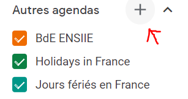
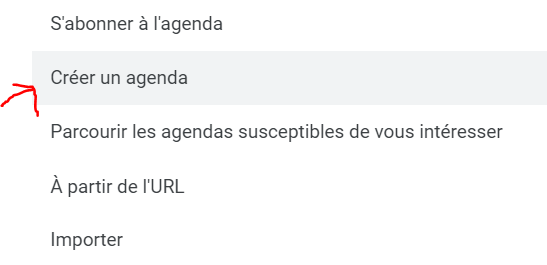
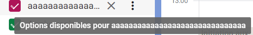
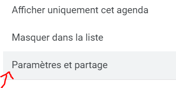
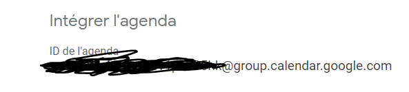

# EDTExtractor v. 0.0.2

Ceci est un extracteur d'emploi du temps pour AurionWeb.  

N'a pas encore été testé sur Linux mais devrait fonctionner.  

Les commentaires lors du fonctionnement sont écrits en anglais parce que ça fait très classe (oui, même le "Going to EDT...").  

## Utilisation (dans l'ordre) :
```
usage: EDTExtractor [options]

Extracteur d'emploi du temps AurionWeb

optional arguments:
  -h, --help            show this help message and exit
  -ng, --no-google      do not upload events to google calendar
  -su, --stop-upload    pauses the program before upload to google calendar. The file "base_results.json" can
                        therefore be modified before upload
  -ics, --ics           saves events to an .ics file. Does not save auto reminders. Automatic when -ng is selected
  -w N, --week N        fetches the schedule from N weeks in the future (0<=N<=10)
  -ui, --user-interface
                        opens the web browser during execution
  -b, --busy            set availability to "busy" in all events
  -l, --links           adds Zoom/BbCollab/Openmeetings links to calendar events description (incomplete)
  -k, --keep-json       keeps generated json file "base_results.json" after program terminates
  -v, --verbose         verbose mode. Shows selenium log infos
  -nt, --no-token       prevent the Google Oauth token to be saved for future uses
  --update              saves current version main .py files in the folder previous_version and updates the program to the latest version
                        
  -mu, --manual-update  to use if you want to manually install an update (no fetch through url)
```

*Note* : à la première utilisation, votre mot de passe Google et une autorisation de connexion de la part du programme peut vous être demandé. Par la suite, les credentials d'autorisation pour l'API sont sauvegardés dans le fichier `token.pickle` (sauf si le drapeau `-nt` est utilisé).
## Mise-en-place : 

Plusieurs étapes sont à réaliser : 

>1. Installation des dépendances
>2. Téléchargement d'un driver de navigateur
>3. Création d'un agenda Google *spécifique* (**<span style="color:#FF0000">IMPORTANT</span>**)
>4. Renseignement des informations de connexion
>5. Renseignement des emplacements des différents éléments fonctionnels

### 1. Installation des dépendances

Python 3 est nécessaire au fonctionnement du programme (dev sur Python 3.8).

`pip install -r requirements.txt` si vous utilisez pip  
Sinon, les packages à installer sont dans `requirements.txt`


### 2. Téléchargement d'un driver de navigateur 
  
L'utilisation d'un navigateur web est requis, le programme faisant usage de `selenium`.  
Note : Pour une utilisation avec ne nouveau Microsoft Edge ou tout autre navigateur basé sur Chromium (sauf Opera), choisir *ChromeDriver*.  

Voici les principaux WebDrivers :
* [ChromeDriver](https://chromedriver.chromium.org/downloads)
* [GeckoDriver](https://github.com/mozilla/geckodriver/releases/) (Firefox)
* [SafariDriver](https://developer.apple.com/documentation/webkit/testing_with_webdriver_in_safari)
* [OperaDriver](https://github.com/operasoftware/operachromiumdriver/releases)

Une fois téléchargé(s), placer l'exécutable/binary dans un fichier appartenant au `PATH` de l'ordinateur, ou ajouter le dossier dans lequel il se trouve au `PATH` (voir https://www.selenium.dev/documentation/en/webdriver/driver_requirements/#adding-executables-to-your-path).

Il est également possible de les installer via `npm`. 


Pour plus d'aide, consulter la documentation de `selenium` [ici](https://www.selenium.dev/documentation/en/webdriver/driver_requirements/).


### 3. Création d'un agenda Google *spécifique* 
(**<span style="color:#FF0000">IMPORTANT</span>**)  

Cette étape est **cruciale** si on veut éviter toute suppression involontaire d'évènements sur notre calendrier Google.  

L'idée est de créer un calendrier dédié au programme sur lequel l'emploi du temps récupéré d'AurionWeb sera uploadé. Il s'affichera au côté des autres calendriers mais le programme ne modifiera pas ceux-ci.  

Étapes à suivre :  

1. Créer un nouvel agenda  
   
     

   
2. Une fois l'agenda créé et nommé, se rendre dans les paramètres  
     

   
3. Localiser la ligne *Intégrer l'agenda* et noter l'identifiant (@group.google.com compris). Il est à renseigner ensuite dans le fichier `filespath.py` (voir partie 5).
   
    

*Note* : si vous souhaitez **VRAIMENT** que les cours soient sur votre agenda "classique", notez l'identifiant `primary`. Vous seuls êtes tenus responsable de potentielles suppressions d'évènements.

### 4. Renseignement des informations de connexion
  
Renseigner les informations de connexion à AurionWeb et Google Calendar dans le fichier `secretensiie.py`.  
Pour ne pas enregistrer son mot de passe AurionWeb, laisser le champ vide (`""`). Dans ce cas, le mot de passe sera demandé à chaque utilisation.  

>**RAPPEL :** Ne ***PAS*** mettre l'identifiant de son calendrier Google principal. En effet, le programme efface certains éléments afin de mettre à jour leurs informations depuis Aurion. Voir la partie 3 pour plus de détail.  

Pour utiliser la fonction d'upload sur Google, il est nécessaire de renseigner le fichier `credentials.json` dans le répertoire `src` (voir [la documentation Google Developers](https://developers.google.com/calendar/quickstart/python#step_1_turn_on_the))

### 5. Renseignement des emplacements des différents éléments fonctionnels

Dans le fichier `filespath.py`, renseigner les différents champs avec les exécutables en question :

* BROWSER_PATH : l'emplacement du navigateur
* DRIVER_PATH : l'emplacement du driver correspondant
* RESULTSJSON_PATH (par défaut vaut `./results/base_results.json`, permet la sauvegarde des données à uploader sur le calendrier Google)
* RESULTSICS_PATH (par défaut vaut `./results/aurion_results.ics`), permet la sauvegarde des évènements au format ics 


## TODOs

* Permettre de récupérer les données de plusieurs semaines à la fois.
* Ajouter des catchs dans le cas d'absence de browser ou de driver
* Mettre à jour les requirements pour la mise-à-jour